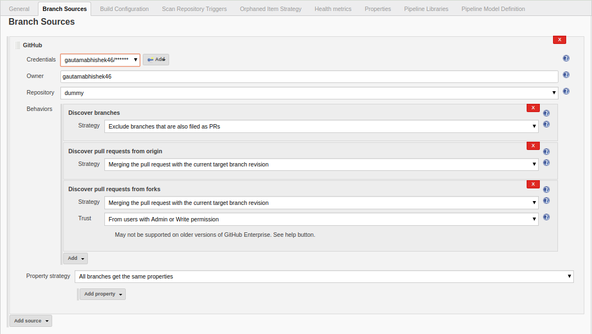

# Simple Pull Request job plugin for Jenkins

[](https://gitter.im/jenkinsci/simple-pull-request-job-plugin?utm_source=badge&utm_medium=badge&utm_campaign=pr-badge&utm_content=badge)

This project aims to develop a Job Plugin which can interact with Bitbucket Server, Bitbucket Cloud, and Github whenever a pull request is created or updated. Users should be able to configure job type using YAML file which will be placed in root directory of the Git repository being the subject of the PR.

Detect the presence of certain types of the report based on a conventional location, and automatically publish them. If the reports are not in a conventional location, users could specify the location using the YML file.

### How to run this plugin

Till this point of time plugin is tested with GitHub plugin, ans it needs to be installed on the jenkins instance.
1. Create a multibranch project.
2. In Branch sources add GitHub (Needs to install Github Plugin)
3. Set required credentials, owner and repository.
4. Set behaviours as follows.


5. Scroll down to Build Configuration and select "by Jenkinsfile.yaml".
6. Edit anyother configurations and hit save. Plugin will automatiacally 
discover all the branches and pull requests and start to build them 
according to "Jenkinsfile.yaml".

To run the demo repository configure the GitHub branch source as shown in the above 
figure. Don't specify git credentials (As no one except @gautamabhishek have them) 
and the build will be successful except one git push step at the last. Everyone can
also use "Scan Repository Now" and "Build Now" (for all branches and PRs).

[Demo repository](https://github.com/gautamabhishek46/dummy)

#### Jenkinsfile.yaml example
```yaml
agent: any

buildResultPaths:
    - path-1
    - path-2

testResultPaths:
    - path-1
    - path-2

stages:
    - name: First
      steps:
        - sh './scripts/hello'
          defaultParameter: ./scripts/hello
    - name: Build
      steps:
        - stepName: sh
          parameters:
            script: ./scripts/build
    - name: Tests
      steps:
        - stepName: sh
          defaultParameter: ./scripts/hello

archiveArtifacts:
    - Jenkinsfile.yaml
    - scripts/hello.sh

artifactPublishingConfig:  # Details are not correct
    host: 192.32.52.12
    user: user53
    credentialId: dummyGitRepo

publishArtifacts:
    - from: Jenkinsfile.yaml
      to: ~/archives
    - from: scripts/hello.sh
      to: ~/archives

```

#### Simple agent example
```yaml
agent:
    label: 'my-label'
    customWorkspace: 'path-to-workspace'
```


#### Agent with docker image example
```yaml
agent:
    label: 'my-label'
    customWorkspace: 'path-to-workspace'
    dockerImage: 'image-name'
    args: 'some argument' # optional
```

#### Agent with dockerfile example
```yaml
agent:
    label: 'my-label'
    customWorkspace: 'path-to-workspace'
    dockerfile: 'image-name'
    dir: 'path-to-directory'  
    args: 'some argument' # optional
```

Note: 
1. Agent arguments are same as declarative pipeline agent arguments except "dockerImage".
2. Don't use dockerImage and dockerfile parameters simultaneously, else it will result in errors.
3. The build will be started for pull request and normal branches after branch indexing.
4. Sections such as tools, post, when, ect are not supported at this point in time.

If there is a need to call a script then use "sh" step name and just give the relative path of 
the script without extension (.bat or .sh). plugin will detect the machine (linux or windows) and 
add the extension on its own.

Users can declare any number of stages but stages named 'Build' and 'Tests' must be declared by the
user. These two stages can contain simple echo steps also. It is needed because at this stage
plugin generate post sections in these two stages to archive artifacts, publish reports and to
push the changes to target branch.

Only xml reports are supported at this point in time.

